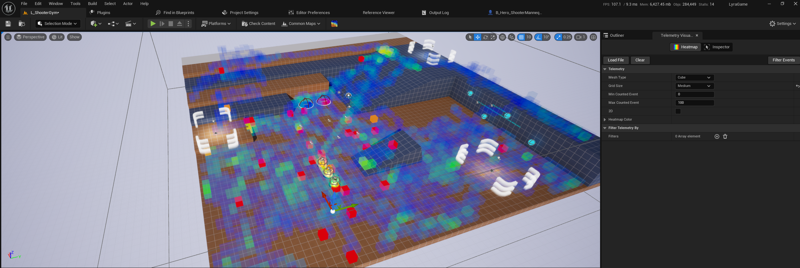
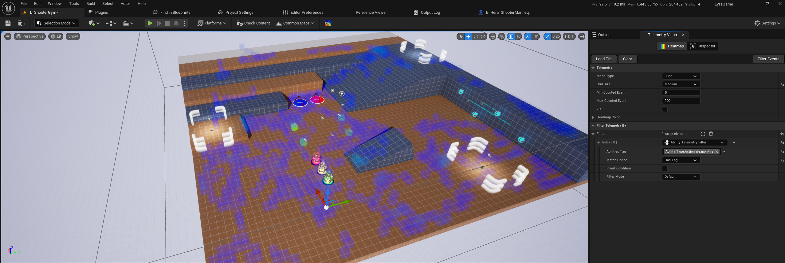
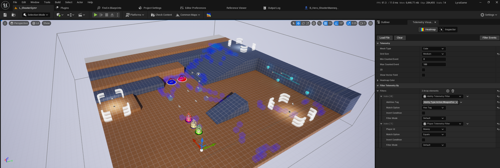

# Telemetry Documentation

A comprehensive tool for recording, analyzing, and visualizing gameplay events, catering to the needs of developers and analysts working with Unreal Engine projects.

# FAQ
Read more [here](./FAQ.md)

## Example Project
- [FPS Project](https://tinyurl.com/22ffteax)
- [Lyra Project (requires Addon)](coming soon)

# Table of Contents
- [Features](#features)
- [Setup](#setup)
- [Initialize the Telemetry](#initialize-the-telemetry)
- [Recording Events ](#recording-events-)
- [Stop Recording](#stop-recording)
- [Visulization  ](#visulization--)
    - [Heatmap Tab](#heatmap-tab)
    - [Inspector Tab](#inspector-tab)
- [Filtering](#filtering)

## Features
 - Record gameplay events in multiple coding languages (Blueprint and C++). 
 - Data storage options: JSON, Unreal Archive, compressed binary files. 
 - High-performance 3D grid-based visualization. 
 - Extensive filtering options for gameplay tags, player actions, team dynamics.
 - Vector field visualization for detailed player movement analysis.
 - Customizable heatmap color gradients and data range adjustments.
 - Future features include UI heatmaps and event timelines.

## Setup

 1. Download the plugin from the Unreal Marketplace,
 2. Enable the Telemetry Plugin
 3. Update the Telemetry Setting (Project Setting)

## Initialize the Telemetry

Once the plugin is enabled in your project, you can access the recording functions.

**Start recording**
Initialize the telemetry
Call the **Start Recording** function Inside the begin play of gamemode or game instance. providing these properties:
- Match Id
- Map Name
- Game Mode
- Clear Events (whether you want to clear previous recorded events; if false it will keep the events from previous session.)

Example:


## Recording Events <a name="recording-events"><a/>
Now that the plugin has been initialized, you are free to add events. 

Record the current player state in an interval, if you need more percise data it could be record in the Tick event, but it might increase the file size. providing these properties:
- Location of the player
- Rotation of the player
- Player Id, it is the plyer's name
- Team Id

Example:


Record the kill event once it occure in the game, it will record the kill and death by a weapon, alose current state of the Killer and Victim. providing these properties:

- Killer Location and Rotation
- Killer Playr Id
- Killer Team Id
- Kiiler Tags (Any gameplay tags that the killer player has)
- Killing Weapon
- Victom Location and Rotation
- Victom Playr Id
- Victom Team Id
- Victom Tags (Any gameplay tags that the victim player has)

Example:


## Stop Recording

Play the game, once you stop the play, the subsystem already save your recorded events in a specific file inside the **Saved/Telemetry** folter.
```
Saved/Telemetry
```

Also, you can stop recording manually by calling **Stop Recording** function


## Visulization  <a name="visualization"/>
Once you have recorded data, you are ready to visualize it!
- In the UE5 Editor, open the project.
- Opne the Telemetry Visualization Widnow by clikc the tool icon on the editor toolbar, or open it from the Windows menu under the **Telemetry Visualizer** category


The Telemetry Visualization window will be opened, the main screen has two main tabs, **Heatmap** and **Inspector**.
Now you can use the visualization to get unique view of your data. 

### Heatmap Tab
Let's look at the Heatmap tab, here you can select a variety of options and combine to see data in to a 3D grid map.
You are able to load multiple files at a time by just selecting as many as you want when the open window pops up, but keep in mind that the system will not load files from different map names. 

- Mesh Type
    - Cube
    - Sphere
    - Custom Mesh
- Grid Size
    - Small (50cm)
    - medium (1m)
    - Large (2m)
- Man and Max Cunted vents (Type Range from Min to Max)
- 2D (2D Grid map)
- Show Vector Field (Player Direction)
- Heatmap Color (Color Range from Min to Max)
- Filters
    - Event Type
    - Player
    - Team
    - Gameplay Tags
    - Kills/deaths by weapon
    - Custom event tag
    - Gameplay Ability (Available in the Telemetry Addon Plugin)


### Inspector Tab

Inspect every single individual event by dropping an inspect actor to the scene and move it around to see the relevant information captured by the event. Change its radius to inspect nearby events.


### Filtering



The image above represents all the events captured in a single session. Let's apply some filters in order to get some meaningful data out of it while exploring the common filtering options.

Filter events by Gameplay Abilities (available in the Telemetry Addon Plugin):
Filters events that were triggered by gameplay abilities. It has a gameplay tag attribute that allows us to leverage the gameplay tags system to increase the filtering options. 

* *Abilities Tag*: Gameplay tag container that allows you look for a range type of abilities.

* *Match Option*: Operation type to be performed on the *Abilities Tag* container attribute. Options are:
    * "Has Tag": Determine if tag to check is present in this container, also checking against parent tags; Ex.: {"A.1"}.HasTag("A") will match while {"A"}.HasTag("A.1") won't;
    * "Has Tag Exact": Determine if tag to check is explicitly present in this container, only allowing exact matches; Ex.: {"A.1"}.HasTagExact("A") won't match.

* *Invert Condition*: This option will negate the condition applied for the filter; For instance, if you're filtering by "Has Tag Exact" and have this property checked, it will basically return all the events that doesn't have that exact gameplay tag.

* *Filter Mode*: 
    * Default: Uses the previous filter output as input;
    * Aggregate: Allows you to combine results from the previous filter. Instead of using the previous filter as input, it will take into account the original set to perform the filtering and combine the results with the previous output;
    * By Pass: The filter won't be applied (it has the same effect as removing the filter from the list).

Having said that, let's filter every time a shot was fired:



Now, let's filter it further by adding a *Player Filter* and check for a specific player, it's worth to mention a few things about the match option:

* *PlayerId*: String with the player ID (in this case it's the player name).

* *Match Option*: Operation to be perfomed on the PlayerId attribute.
    * Equals: Lexicographically tests whether PlayerId is equivalent to the Other given string (Case sensitive. Upper/lower casing must match for strings to be considered equal)
    * Contains: Whether PlayerId contains the specified substring (Ignore case. Upper/lower casing does not matter when making a comparison).



Cool, we now know that this player was firing his weapon mostly from the ramp region of that map.
