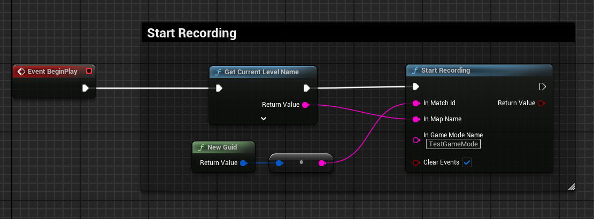
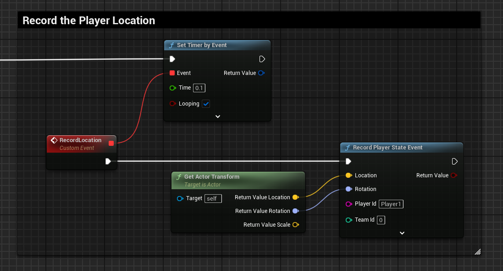
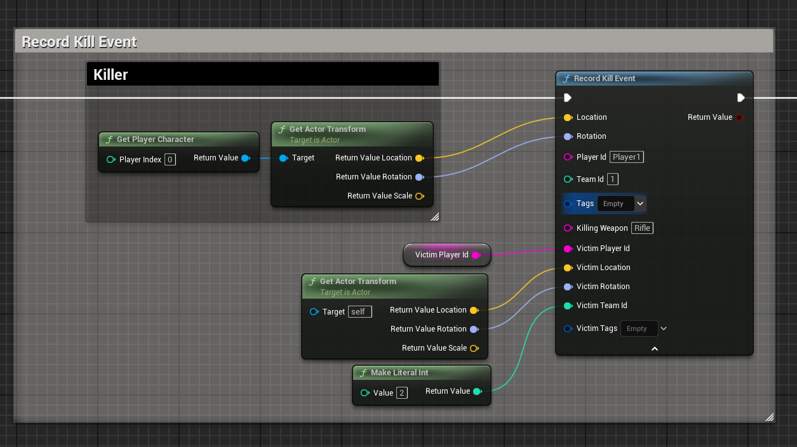
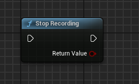
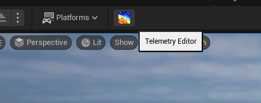
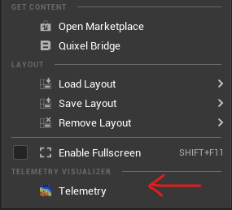
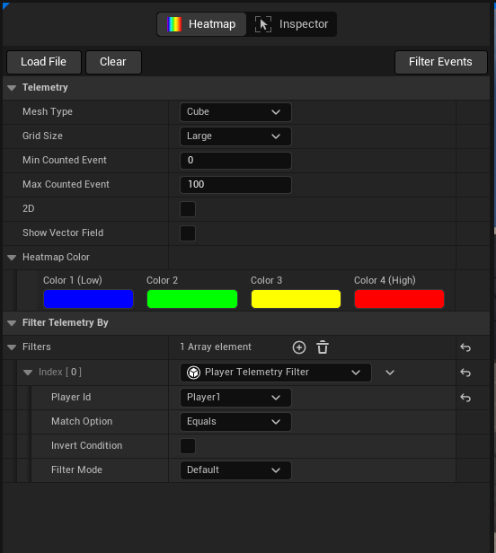
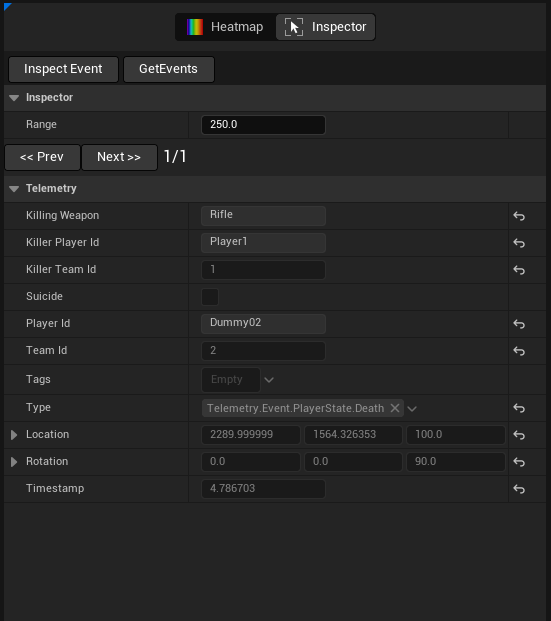

# Telemetry Documentation

A comprehensive tool for recording, analyzing, and visualizing gameplay events, catering to the needs of developers and analysts working with Unreal Engine projects.


## Features
 - Record gameplay events in multiple coding languages (Blueprint and C++). 
 - Data storage options: JSON, Unreal Archive, compressed binary files. 
 - High-performance 3D grid-based visualization. 
 - Extensive filtering options for gameplay tags, player actions, team dynamics.
 - Vector field visualization for detailed player movement analysis.
 - Customizable heatmap color gradients and data range adjustments.
 - Future features include UI heatmaps and event timelines.

## Setup

 1. Download the plugin from the Unreal Marketplace,
 2. Enable the Telemetry Plugin
 3. Update the Telemetry Setting (Project Setting)

## Initialize the Telemetry

Once the plugin is enabled in your project, you can access the recording functions.

**Start recording**
Initialize the telemetry
Call the **Start Recording** function Inside the begin play of gamemode or game instance. providing these properties:
- Match Id
- Map Name
- Game Mode

Example:



## Recording Events
Now that the plugin has been initialized, you are free to add events. 

Record the current player state in an interval, if you need more percise data it could be record in the Tick event, but it might increase the file size. providing these properties:
- Location of the player
- Rotation of the player
- Player Id, it is the plyer's name
- Team Id

Example:




Record the kill event once it occure in the game, it will record the kill and death by a weapon, alose current state of the Killer and Victim. providing these properties:

- Killer Location and Rotation
- Killer Playr Id
- Killer Team Id
- Kiiler Tags (Any gameplay tags that the killer player has)
- Killing Weapon
- Victom Location and Rotation
- Victom Playr Id
- Victom Team Id
- Victom Tags (Any gameplay tags that the victim player has)

Example:



## Stop Recording

Play the game, once you stop the play, the subsystem already save your recorded events in a specific file inside the **Saved/Telemetry** folter.
```
Saved/Telemetry
```

Also, you can stop recording manually by calling **Stop Recording** function



## Visulization
Once you have recorded data, you are ready to visualize it!
- In the UE5 Editor, open the project.
- Opne the Telemetry Visualization Widnow by clikc the tool icon on the editor toolbar, or open it from the Windows menu under the **Telemetry Visualizer** category





The Telemetry Visualization window will be opened, the main screen has two main tabs, **Heatmap** and **Inspector**.
Now you can use the visualization to get unique view of your data. 

### Heatmap Tab
Let's look at the Heatmap tab, here you can select a variety of options and combine to see data in to a 3D grid map.



- Mesh Type
    - Cube
    - Sphere
    - Custom Mesh
- Grid Size
    - Small (50cm)
    - medium (1m)
    - Large (2m)
- Man and Max Cunted vents (Type Range from Min to Max)
- 2D (2D Grid map)
- Show Vector Field (Player Direction)
- Heatmap Color (Color Range from Min to Max)
- Filtes
    - 


### Inspector Tab

